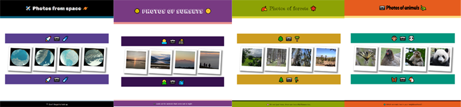

## Introduction

Have you ever thought about designing your own website but not been sure where to start? Our **discover** projects allow you to try out some key web development skills using short, taster projects. Take a look below to discover which skills you can try out. 

### What skills can you try out?

**Photo gallery**
+ Add images to a project
+ Add styles to a project using classes
+ Add hover effects to your images

**Choose your style**
+ Add an emoji to your webpage
+ Select website styling that works well with your chosen emoji

**Animate it!**
+ Explore different ways to animate parts of your webpage
+ Choose which animations to add to your webpage

### After trying these projects, you should know:

+ What a web page is
+ Whether you would like to create web pages
+ Whether you need any more skills before creating web pages
+ Where to go to start making your own web pages

--- collapse ---

---
title: About Discover projects
---

Discover projects are short 'taster' projects that can be completed in 10-15 minutes. They are a great way to try out a new technology and find out if you (or your club members) are ready to dive deeper into a 321 Make! path to develop skills and independence.

**Discover** projects are available as a one page printable which can be viewed online, as an offline pdf document or printed on paper. 

--- /collapse ---

